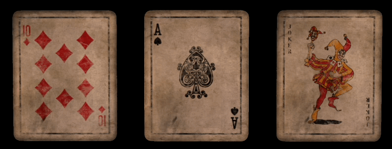

# Dissolving Cards with Three.js

A small showcase of a dissolve shader and some animation. Inspired by the Shader chapter
in [Bruno Simon's](https://twitter.com/bruno_simon) excellent course on ThreeJS. Written
with [React-Three-Fiber](https://github.com/pmndrs/react-three-fiber).



## Live Demo

Head over to [demo-threejs-dissolving-cards.vercel.app](https://demo-threejs-dissolving-cards.vercel.app) to see the project live.

## Running locally

First, install the dependencies:

```bash
npm i
```

Then, run the development server:

```bash
npm run dev
```

Open [http://localhost:5173](http://localhost:5173) with your browser to see the result.

# Credits

Vintage cards [minime453](https://opengameart.org/users/minime453) by on [OpenGameArt](https://opengameart.org/content/vintage-playing-cards).

# Todos

* [x] Add hover state
* [x] Add cards
* [x] Destroy cards
* [x] Add credit
* [x] Update README
